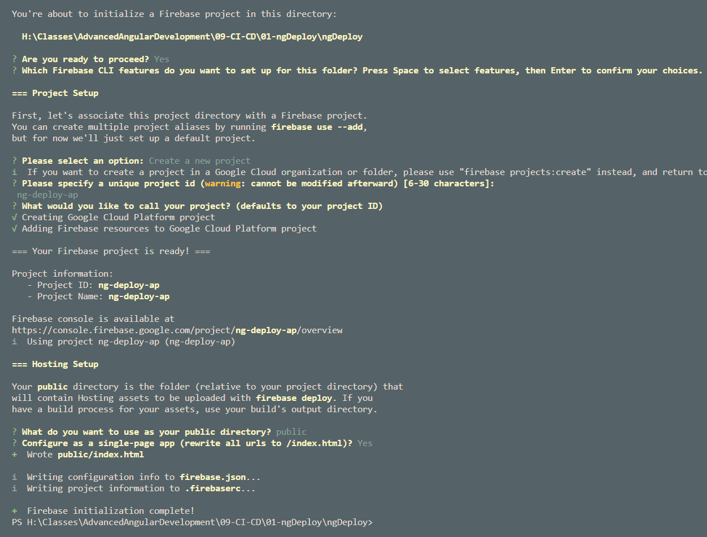
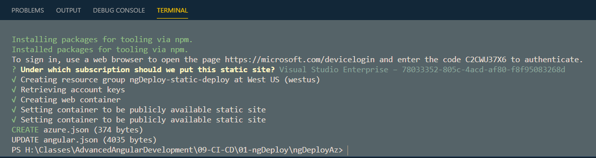

# Deployment

[ng deploy](https://angular.io/cli/deploy)

## Firebase

[Firebase CLI Reference](https://firebase.google.com/docs/cli)

Install firebase cli:

```
npm install -g firebase-tools
```

Create a project & app

```
firebase login
```



List Projects:

```
firebase projects:list
```

Add Firebase Deploy:

```
ng add @angular/fire
```

> Note: Adds `@angular/fire`, `firebase` and some util libs as dev dependencies

Updates `.firebaserc`:

```json
"targets": {
    "ng-deploy-ap": {
      "hosting": {
        "ngDeploy": [
          "ng-deploy-ap"
        ]
      }
    }
  }
```

Updates angular.json:

```json
"deploy": {
            "builder": "@angular/fire:deploy",
            "options": {}
          }
```

Run deployment:

```
ng deploy
```

## Azure

[ng-deploy-azure](https://github.com/Azure/ng-deploy-azure)

Add `@azure/ng-deploy`:

```
ng add @azure/ng-deploy
```

Complete device auth:



### Additional options <a name="options"></a>

#### Manual configurations <a name="manual"></a>

To manually select and/or create the resources needed for deployment,
use the `--manual` (or `-m`) option:

```sh
ng add @azure/ng-deploy --manual
```

You will be prompted to select or create the resource group and the storage account
in which the app will be deployed. If you choose to create a resource group
you will be asked to select the geographical location.

#### Passing configuration options <a name="config"></a>

You can pass the names of the resources you'd like to use when running the command.
Resources that don't already exist will be created.
If using `--manual` you will be prompted to select the remaining configuration options.
Otherwise, defaults will be used.

The available options are:

- `--subscriptionId` (`-i`) - subscription ID under which to select and/or create new resources
- `--subscriptionName` (`-n`) - subscription name under which to select and/or create new resources
- `--resourceGroup` (`-g`) - name of the Azure Resource Group to deploy to
- `--account` (`-a`) - name of the Azure Storage Account to deploy to
- `--location` (`-l`) - location where to create storage account e.g. `"West US"` or `westus`
- `--telemetry` (`-t`) - see [Data/Telemetry](#telemetry)

Example:

```sh
ng add @azure/ng-deploy -m -l="East US" -a=myangularapp
```

To create an Azure Ressource Group and App Service execute `create-ressources.azcli`. Write down the deployment Url.

> Note: To fully leverage `*.azcli` use [Azure CLI Tools](https://marketplace.visualstudio.com/items?itemName=ms-vscode.azurecli) and [Azure Account](https://marketplace.visualstudio.com/items?itemName=ms-vscode.azure-account). [Azure CLI](https://docs.microsoft.com/en-us/cli/azure/reference-index?view=azure-cli-latest) is required an can be installed for [Windows](https://aka.ms/installazurecliwindows) or on Mac, Linux using `install-az-cli-linux.sh`.
